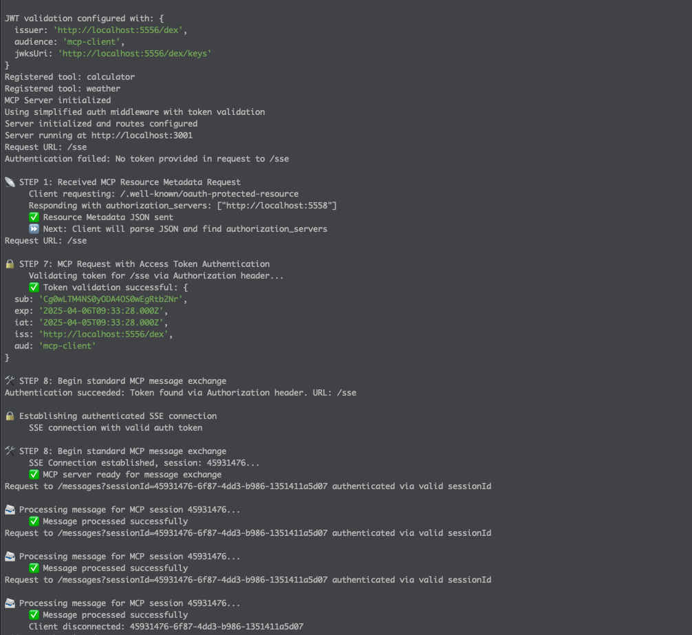
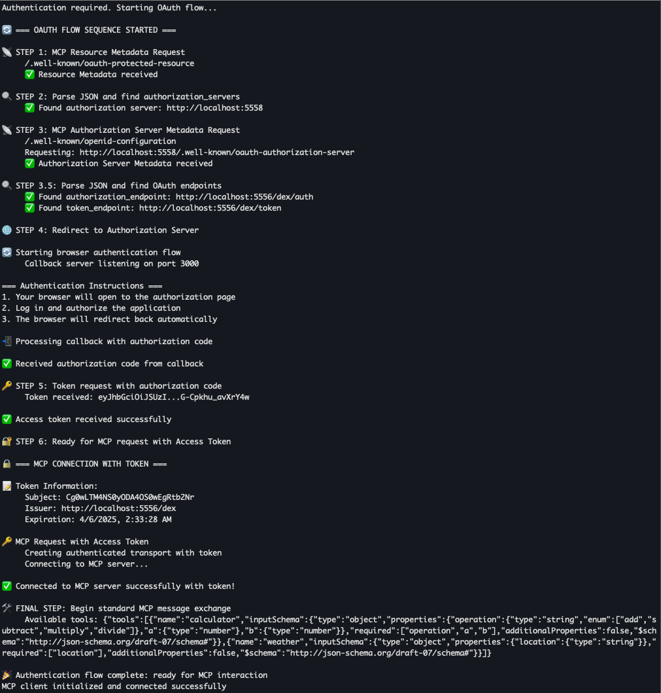
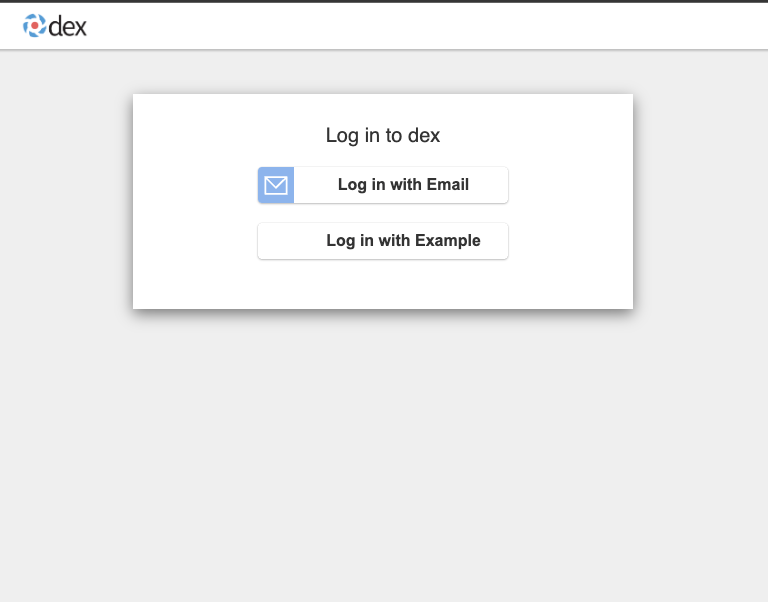
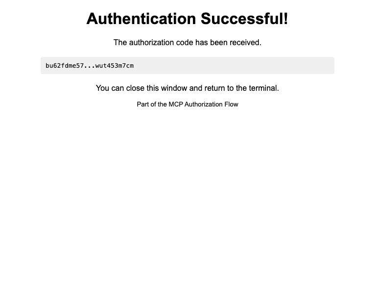

# OAuth Discovery Demo for Model Context Protocol (MCP)

This repo is a cobbled together reference implementation demonstrating how OAuth 2.0 authorization can be integrated into the [Model Context Protocol (MCP)](https://modelcontextprotocol.io) using [Aaron Parecki's suggestions on OAuth for MCP](https://aaronparecki.com/2025/04/03/15/oauth-for-model-context-protocol). The intent was to understand what the pain points are in actually building it.

## 🔍 Overview

This demo shows how an MCP-compatible resource server can expose OAuth metadata using [`/.well-known/oauth-protected-resource`](https://datatracker.ietf.org/doc/html/rfc9470), allowing clients to discover the appropriate authorization server without assuming the MCP server handles both authentication and authorization.

It mirrors the architecture and intent of Aaron Parecki's blog post, but tries to adapat it into a working local environment.

## ⚙️ What's Included

- `resource-server/`: MCP-style server that:
  - Exposes `/.well-known/oauth-protected-resource`
  - Serves a protected SSE endpoint using cookie-based auth
- `busybox server`: A separate server that statically serves `/.well-known/oauth-authorization-server` metadata
- `dex idp and auth server`: Dex is being used both as an idp and authorization server

## 🧩 Notes & Limitations

- ✅ **Split RS/AS**: As recommended in the blog post, the resource server and authorization server are **completely separate processes**.
- ❌ **No custom headers over SSE**: Due to limitations of the EventSource spec, **custom headers (e.g., `Authorization`) are not supported** in SSE requests. Cookie-based auth is required.
- ⚠️ **SSE & HTTP Headers**: HTTP Headers cannot be set after the initial handshake for SSE .
- ⚠️ **MCP SDKs have poor DX**: This implementation was built manually because current MCP SDKs (as of April 2025) are missing features and are very awkward to use

## 📖 Background & Credits

This work is directly inspired by Aaron Parecki's excellent post:
> [Let's Fix OAuth in MCP – Aaron Parecki, April 3, 2025](https://aaronparecki.com/2025/04/03/15/oauth-for-model-context-protocol)

If you're thinking about how to structure OAuth in MCP systems, read it.

## 🚀 Running It

1. **Install Docker**
   ```bash
   # Install Docker according to your OS: https://docs.docker.com/get-docker/
   ```

2. **Start the Authentication Server**
   ```bash
   # Start the Dex server and related services
   docker-compose up
   ```

3. **Start the MCP Server**
   ```bash
   # Install dependencies and start the server
   cd mcp-server && npm install && npm run dev
   ```

4. **Start the MCP Client**
   ```bash
   # In a new terminal, install dependencies and start the client -- this will execute the auth flow immediately
   cd mcp-client && npm install && npm run dev
   ```

## 🖼️ Demo Flow Screenshots

### 1. MCP Server Logs
The server initializes, registers tools, and validates tokens using JWT.



### 2. MCP Client Starting OAuth Flow
The client detects auth is required and begins the OAuth discovery flow sequence.



### 3. Browser Redirect to Dex Login
The user is redirected to Dex for authentication.



### 4. Authentication Success
After successful login, the authorization code is returned to the client.



After this flow completes, the MCP client communicates securely with the MCP server using the obtained access token.

